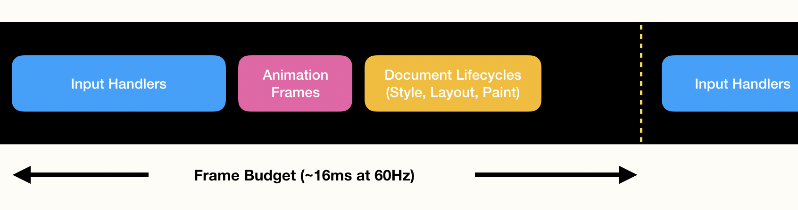
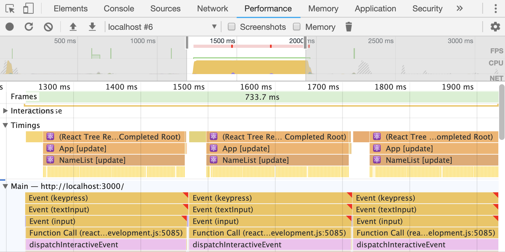

In modern applications, user interfaces often have to juggle multiple parts at the same time: A search component needs to respond to user input while providing auto completion results; An interactive dashboard needs to update the charts while loading data from the server and sending analytics data to your backend.

All these parallel steps can lead to janky interfaces and unhappy users – Let's learn how we can fix this.

## Scheduling in User Interfaces

**Users expect immediate feedback.** Wether a user is clicking on a button or adding text to an input field, they expect some kind of confirmation immediately. The button should show a modal, or the input field will display the key that was typed.

To visualize this, let's take a look at the demo application that Dan Abramov showed us at his talk [Beyond React 16](https://reactjs.org/blog/2018/03/01/sneak-peek-beyond-react-16.html) at JSConf Iceland 2018. The more you type into the input box above, the more detailed the charts below will get. Since both of those updates run at the same time, the input feels janky.

<video src="/blog/scheduling-in-react/sync-mode.mp4" muted="true" autoplay loop></video>

One thing that we can see in the example above is that it's more important to update the text box with the user input than it is to update the carts. A version that prioritizes that will appear a lot more responsive to the end user:

<video src="/blog/scheduling-in-react/concurrent-mode.mp4" muted="true" autoplay loop></video>

Unfortunately, current user interface architectures makes it non trivial to implement this kind of prioritization. One way to solve this is by [debouncing](https://davidwalsh.name/javascript-debounce-function) the chart update. The problem with this is that the charts still render in one go synchronously when the debounced callback fires, which will again cause our user interface to take multiple seconds during which it is not responsive. We can do better!

## Browser Event Loop

Before we learn more about concrete solutions, let's dig deeper and understand why the browser has issues these kind of user interfaces.

Most JavaScript code is executed on the same thread that is also responsible for other document lifecycles like layout and paint[^1]. This means that whenever your JavaScript code runs, the browser is blocked form doing anything else.

To keep the user interface responsive, we only have a very short time frame before we need to be able to receive the next input events. In the browser run loop visualization[^2] below, you can see that we only have 16 milliseconds (on a typical 60Hz screen) before the next frame is drawn and the next events need to be processed.



Most JavaScript frameworks (including the current version of React) will run updates synchronously. You can think of this as a function `render()` which will only return once the DOM was updated. During this time, the main thread is blocked.

## Problems With Current Solutions

From all of the information above, we can formulate two problems that we have to solve in order to get more responsive user interfaces:

1. **Long running tasks cause frame drops.** We need to make sure our tasks are small and can be completed within a couple of milliseconds.
2. **Different parts have different importance.** In the example above you could see that prioritizing the input box leads to a better user experience. We need a way to schedule work.

## Concurrent React and the Scheduler

_⚠️ Warning: The following APIs are not stable yet and will change. I will do my best to keep this post updated._

To implement a properly scheduled user interface with React, we have to look into two (still unstable) React features:

- **Concurrent React (also known as Time Slicing).** With the help of the new [Fiber architecture](https://www.youtube.com/watch?v=ZCuYPiUIONs) rewrite that got release with React v16, React can now pause rendering of large component trees and yield[^3] to the main thread before resuming.

  ➡️ With this feature, we're able to split long running rendering tasks into smaller chunks.

- **Scheduler.** With a general purpose browser scheduler developed by the React Core team, it's possible to register callbacks with different priority levels.

  The different priority levels come with a timeout. At the point of writing this article, we have:

  - `Immediate` for tasks that need to run now.
  - `UserBlocking` (250ms timeout) for tasks that should run as the result of a user interaction (e.g. a button click).
  - `Normal` (5s timeout) for rendering non-interactive parts.
  - `Low` (10s timeout) for tasks that can be deferred but must still complete (e.g. an analytics ping).
  - `Idle` (no timeout) for tasks that do not have to run. (e.g. offscreen content that is promoted to a higher priority when it becomes visible).

  The timeouts are necessary to make sure that lower priority work still runs at all even if you have so much higher priority work to do, that it could run continuously. In scheduling algorithms, this problem is refereed to as [starvation](<https://en.wikipedia.org/wiki/Starvation_(computer_science)>). It gives us the guarantee that every timeout will eventually runs (e.g. we won't miss a single analytics ping even if we have ongoing animations in our app).

  ➡️ With this feature, we're can run tasks with different importance.

## Scheduling in Action

Let's see how we can use these features to make an app feel a lot more responsive. To do this, we take a look at Scheduletron 3000, an app that I built that allows you to highlight a search term in a list of names. Let's take a look at the current implementation first.

<!-- prettier-ignore -->
```js
function App() {
  const [searchValue, setSearchValue] = React.useState();

  function handleChange(value) {
    setSearchValue(value);
  }

  return (
    <div>
      <SearchBox onChange={handleChange} />
      <NameList searchValue={searchValue} />
    </div>
  );
}

function SearchBox(props) {
  const [searchValue, setSearchValue] = React.useState();

  function handleChange(event) {
    const value = event.target.value;

    setSearchValue(value);
    props.onChange(value);
    sendAnalyticsPing(value);
  };

  return (
    <input
      type="text"
      value={searchValue}
      onChange={handleChange}
    />
  );
}

ReactDOM.render(<App />, container);
```

_ℹ️ This example uses [React Hooks](https://reactjs.org/docs/hooks-intro.html). If you're not familiar with them yet, take a look at the [CodeSandbox code](https://codesandbox.io/s/j3zrqpzkr5). You might also wonder why we use two different state variables for this example. I'll explain this in a bit._

The `<SearchBox>` displays the input element which is controlled by the local state `searchValue`. When the input changes, it will call the `onChange` property with the new value. The new input value is then stored inside the `<App>` component's `searchValue` state and passed over to the `<NameList>`. At the end, we also send an analytics ping to our server.

Try it out! Type a name (e.g. "Adeline") in the search box below and see how it works.

<iframe src="https://codesandbox.io/embed/j3zrqpzkr5?fontsize=14&hidenavigation=1&view=preview" style="width:100%; height:500px; border:0; border-radius: 4px; overflow:hidden;" sandbox="allow-modals allow-forms allow-popups allow-scripts allow-same-origin"></iframe>

You might notice that the interface is not very responsive. In the example linked above, I artificially slowed down the rendering time of the individual names. And since there are _a lot_ of them, it will have a significant impact on the applications performance.

This is not good 😰. Our users expect immediate feedback but the app is unresponsive for seconds after a keystroke. To understand what's going on, let's take a look at the Chrome DevTools Performance tab. Here's a screenshot of a recording while I type the word "Ada" into the search box.


a

a

a

a

a

a

a

a

a

a

a

a

[^1]: The MDN web docs feature a great [article](https://developer.mozilla.org/en-US/docs/Tools/Performance/Scenarios/Intensive_JavaScript) about this issue.
[^2]: The graphic is based on work by Subhie Panicker's and Jason Miller's talk about [A Quest to Guarantee Responsiveness](https://developer.chrome.com/devsummit/schedule/scheduling-on-off-main-thread) at the Chrome Dev Summit 2018.
[^3]: A fancy term for returning for a function that is able to resume. Check out [generator functions](https://developer.mozilla.org/en-US/docs/Web/JavaScript/Reference/Operators/yield) for a similiar concept.
